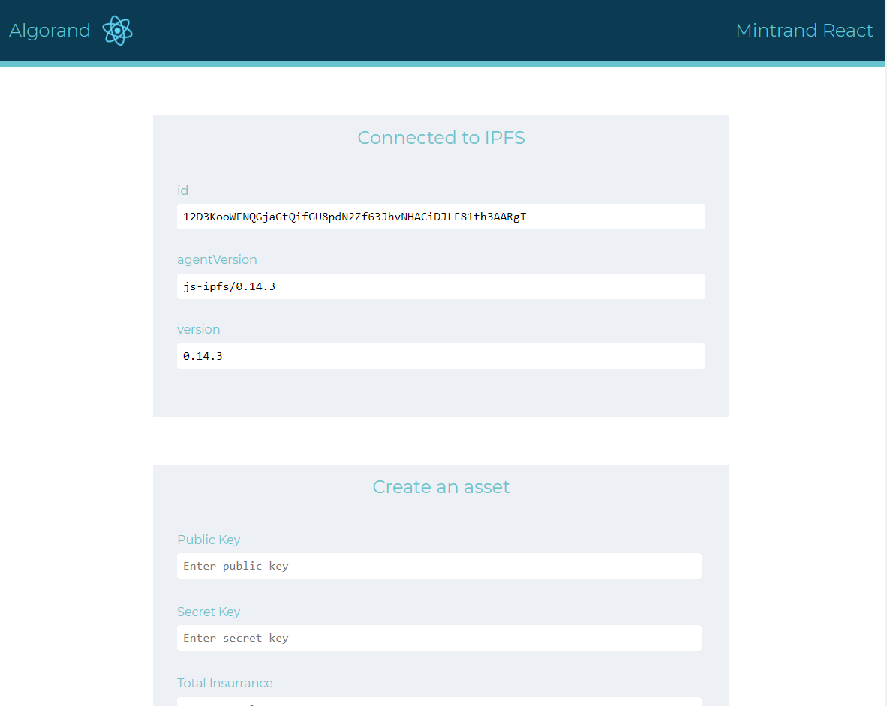

## About The Project

Mintrand is a opensource Javascript application library that allows you to mint NFTs on multiple blockchain using the IPFS storage system offered by Filecoin.

The library supports the creation of NFTs Assets on multiple Blockchain either by using an API system pre-designed by us or by using a Reactjs simplified graphical interface.

## How will IPFS, Filecoin, or related technology be used for this project? 

We use Filecoin's IPFS system to be able to store dynamic data from NFTs such as Images, videos and even music to produce a unique signature hash of the original file thanks to the Filecoin blockchain.


## Getting Started

### Pre requisites

Make sure you have installed all of the following prerequisites on your development machine:

- Git - [Download & Install Git](https://git-scm.com/downloads). OSX and Linux machines typically have this already installed.
- Node.js - [Download & Install Node.js](https://nodejs.org/en/download/) and the npm package manager.

### Installation and Running example

```console
> npm install
> npm start
```

Now open your browser at `http://localhost:3000`

### Available Scripts from create-react-app

Before starting the project, it is necessary to create an .env file based on the .env.temp file. The node used here is provided by purestake.io.
You can use other nodes but this will require the modification of the Algorand functions to match the node 


After that, in the project directory, you can run:

#### `npm start`

Runs the app in the development mode.<br>
Open [http://localhost:3000](http://localhost:3000) to view it in the browser.

The page will reload if you make edits.<br>
You will also see any lint errors in the console.

#### `npm test`

Launches the test runner in the interactive watch mode.<br>
See the section about [running tests](https://facebook.github.io/create-react-app/docs/running-tests) for more information.

#### `npm run build`

Builds the app for production to the `build` folder.<br>
It correctly bundles React in production mode and optimizes the build for the best performance.

But with modern hosting services like Heroku, Netlity or Fleek, you can skip the build because they will do a complete github deployment for you. See the React official page about [deployment](https://facebook.github.io/create-react-app/docs/deployment) for more information.

## Usage

This is a minimal demonstration of how to use `js-ipfs` in a `create-react-app` generated app.

It boots up a `js-ipfs` instance (an IPFS node) via a custom React hook in `./src/hooks/use-ipfs-factory.js`, which is called from `./src/App.js`. Once the IPFS node is set up, `./src/App.js` displays the [PeerId](https://docs.libp2p.io/concepts/peer-id/) of this node and the version number of `js-ipfs` used to spawn it.

All React applications store their main logic in `App.js`:

- `App.js` renders the cosmetics of the demo and calls `useIpfs` to retrieve the `id` of the node
- `useIpfsFactory.js` initialises and closes the IPFS local node
- `useIpfs.js` does the actual calls to IPFS to retrieve the property specified in argument (here the retrieved property is `id`, requested from `App.js`)




_For more examples, please refer to the [Documentation](#documentation)_

## References

- Documentation:
  - [IPFS CONFIG](https://github.com/ipfs/js-ipfs/blob/master/docs/CONFIG.md)
  - [JS ALGORAND SDK](https://github.com/algorand/js-algorand-sdk/blob/develop/README.md)

## Documentation

- [Config](https://docs.ipfs.io/)
- [IPFS Core API](https://github.com/ipfs/js-ipfs/tree/master/docs/core-api)
- [ALGORAND SDK](https://github.com/algorand/js-algorand-sdk)

## Contributing

Contributions are what make the open source community such an amazing place to be learn, inspire, and create. Any contributions you make are 

**greatly appreciated**.

1. Fork the Mintrand Project
2. Create your Feature Branch (`git checkout -b feature/amazing-feature`)
3. Commit your Changes (`git commit -a -m 'feat: add some amazing feature'`)
4. Push to the Branch (`git push origin feature/amazing-feature`)
5. Open a Pull Request

## Issue

To resolve start issue : 

```javascript
ERROR in ./node_modules/algosdk/dist/browser/algosdk.min.js 7471:55-72
Module not found: Error: Can't resolve 'crypto' in 'C:\Users\Mikhael\Documents\Projet\ORISGAS\mintrand\node_modules\algosdk\dist\browser'

BREAKING CHANGE: webpack < 5 used to include polyfills for node.js core modules by default.      
This is no longer the case. Verify if you need this module and configure a polyfill for it.
```


Use this following instructions :

1. Open (`project/node_modules/react-scripts/config/webpack.config.js`)
2. In fallback add "crypto": (`require.resolve("crypto-browserify")`)
As 

```javascript
resolve: {
   fallback: {
      crypto: require.resolve("crypto-browserify"),
      stream: require.resolve('stream-browserify')
   }
}
```

3. Then install this dependencies : (`npm i crypto-browserify stream-browserify`)
4. Restart your app.
